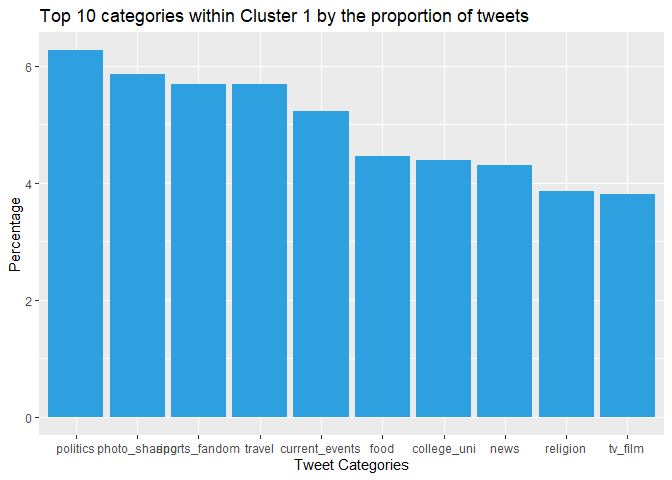

## Question 1: Clustering and PCA

### I first ran PCA on those 11 chemical properties.

### I observed that red and white wines form clusters in the first graph. This implies that clustering could be effective even after PCA has been applied. The second graph shows that the attributes are dispersed, making it difficult to identify a pattern.

### I chose the two-cluster model initially to test if it would naturally produce two clusters of red and white wines. The first graph depicts how the two clusters are generated based on color and quality; one cluster appears to have red wine while the other appears to have white wine across all qualities.

### Next, I chose the four-cluster model in the hopes of seeing four types of wine, low/high qualities, and red/wine. The second graph depicts the four clusters across different wine colors and qualities. I can’t seem to locate a consistent pattern for the groupings I was looking for.

### I then graphed the clusters on the PCA axes, with the shape indicating color/quality. We can see how the clusters are useful for explaining colors, but not so much for explaining qualities. That is, in the first graph, practically all points belong to one color of wine, whereas there are numerous points in different clusters with the same quality.

## Question 2: Market Segmentation

### Let’s gather some market knowledge. In this code sample, we’ll see what the top five most popular tweet categories are.

<table>
<thead>
<tr class="header">
<th style="text-align: left;"></th>
<th style="text-align: right;">Total</th>
</tr>
</thead>
<tbody>
<tr class="odd">
<td style="text-align: left;">chatter</td>
<td style="text-align: right;">34671</td>
</tr>
<tr class="even">
<td style="text-align: left;">photo_sharing</td>
<td style="text-align: right;">21256</td>
</tr>
<tr class="odd">
<td style="text-align: left;">health_nutrition</td>
<td style="text-align: right;">20235</td>
</tr>
<tr class="even">
<td style="text-align: left;">cooking</td>
<td style="text-align: right;">15750</td>
</tr>
<tr class="odd">
<td style="text-align: left;">politics</td>
<td style="text-align: right;">14098</td>
</tr>
<tr class="even">
<td style="text-align: left;">sports_fandom</td>
<td style="text-align: right;">12564</td>
</tr>
</tbody>
</table>

### Ignoring `chatter` since it doesn’t fit into any of the categories. The top four most popular tweet categories in the dataset are `photo sharing`, `health_nutrition`, `cooking`, `politics` and `sports_fandom`.

### Let’s see if we can use a normal PCA algorithm to analyze the data.

    ## Importance of first k=3 (out of 36) components:
    ##                           PC1     PC2     PC3
    ## Standard deviation     2.1186 1.69824 1.59388
    ## Proportion of Variance 0.1247 0.08011 0.07057
    ## Cumulative Proportion  0.1247 0.20479 0.27536

### Because we aren’t looking for a certain type of tweet, the conventional PCA isn’t really useful in this scenario. However, using this graph to organize them into clusters can reveal the categories that are related.

### Let’s use a hierarchical clustering model to see if we can combine the categories together to obtain a better picture of the market segments as a whole.

    ##    1    2 
    ## 7880    2

### The cluster dendogram, which employs euclidean distance and average distance to categorize the marget segments, does not provide any information about the segments in general.

### Let’s perform k-means clustering, which, when combined with the PCA approaches, should yield some useful market segments. The first step is to determine the optimal value for k to employ in the `kmeans` approach. Calculate the `withinss`, `betweenss`, and `CH-Index` from these values for each value of `k`. This can assist us in determining the optimal `k` value.

### I decided to go with `k=3` (nearest integer after the peak) as I think the improvement stops after `k=3`.

### This plot depicts how the clusters divide the PCA plot, and it appears that each of these graphs belongs to a separate category. Let’s take a closer look at that. I begin by selecting the k-means cluster and grouping the tweets by cluster, then adding the total number of tweets. Remove the words `cluster`, `chatter` and `uncategorized` as they do not belong in any market segment.

### Let’s plot the top 5 categories suggested by each of the clusters used in k-means.

### Each clusters give us interesting results,

### (i) `Cluster1` - The top ten categories in the graph all have a similar percentage of tweets, ranging from 4-6 percent. This category includes the vast majority of the population.

### (ii) `Cluster2` - the top four categories, `photo sharing,` `cooking,"shopping,` and `college uni,` create a market category. This, I believe, is typical of young and college students.

### (iii) `Cluster3` consists of three market segments: `health nutrition,` `personal fitness,` and `cooking.` This is a separate `health` market segment.

### There are a lot of similarities in the tweet categories between the different clusters, which is to be expected, but `k-means` extracts some helpful information on the `market categories` of people who use the `NutrientH20` product. We recommend that they target `college students,` `younger audience,` and those interested in `personal fitness,` and `healthy living,` based on this.

## Question 3: Association rules for grocery purchase

    ## [1] 4.409456

    ## Apriori
    ## 
    ## Parameter specification:
    ##  confidence minval smax arem  aval originalSupport maxtime support minlen
    ##         0.4    0.1    1 none FALSE            TRUE       5   0.002      1
    ##  maxlen target  ext
    ##       4  rules TRUE
    ## 
    ## Algorithmic control:
    ##  filter tree heap memopt load sort verbose
    ##     0.1 TRUE TRUE  FALSE TRUE    2    TRUE
    ## 
    ## Absolute minimum support count: 19 
    ## 
    ## set item appearances ...[0 item(s)] done [0.00s].
    ## set transactions ...[169 item(s), 9835 transaction(s)] done [0.01s].
    ## sorting and recoding items ... [147 item(s)] done [0.00s].
    ## creating transaction tree ... done [0.00s].
    ## checking subsets of size 1 2 3 4 done [0.00s].
    ## writing ... [1850 rule(s)] done [0.00s].
    ## creating S4 object  ... done [0.00s].

### I set the `maxlen` to 4 because the average number of items in a grocery list is 4.41. Due to the large number of items, I chose a low support of.002 as the threshold, with a confidence of.4. I didn’t get many rules with more support. Plus, I figured that if someone buys something with a probability of 0.4 after placing something else in the shopping cart, it’s very significant. Out of all the rules with the parameters I supplied, the rules with lift greater than 4 are listed in the table below.

    ##      lhs                         rhs                      support confidence    coverage     lift count
    ## [1]  {liquor}                 => {bottled beer}       0.004677173  0.4220183 0.011082867 5.240594    46
    ## [2]  {other vegetables,                                                                                
    ##       rice}                   => {root vegetables}    0.002236909  0.5641026 0.003965430 5.175325    22
    ## [3]  {rice,                                                                                            
    ##       whole milk}             => {root vegetables}    0.002440264  0.5217391 0.004677173 4.786665    24
    ## [4]  {herbs,                                                                                           
    ##       yogurt}                 => {root vegetables}    0.002033554  0.5714286 0.003558719 5.242537    20
    ## [5]  {herbs,                                                                                           
    ##       other vegetables}       => {root vegetables}    0.003863752  0.5000000 0.007727504 4.587220    38
    ## [6]  {herbs,                                                                                           
    ##       whole milk}             => {root vegetables}    0.004168785  0.5394737 0.007727504 4.949369    41
    ## [7]  {other vegetables,                                                                                
    ##       semi-finished bread}    => {tropical fruit}     0.002236909  0.4313725 0.005185562 4.110997    22
    ## [8]  {grapes,                                                                                          
    ##       pip fruit}              => {tropical fruit}     0.002135231  0.5675676 0.003762074 5.408941    21
    ## [9]  {cat food,                                                                                        
    ##       other vegetables}       => {root vegetables}    0.002846975  0.4375000 0.006507372 4.013818    28
    ## [10] {frozen meals,                                                                                    
    ##       pip fruit}              => {tropical fruit}     0.002135231  0.4666667 0.004575496 4.447351    21
    ## [11] {butter,                                                                                          
    ##       hard cheese}            => {whipped/sour cream} 0.002033554  0.5128205 0.003965430 7.154028    20
    ## [12] {hard cheese,                                                                                     
    ##       whipped/sour cream}     => {butter}             0.002033554  0.4545455 0.004473818 8.202669    20
    ## [13] {candy,                                                                                           
    ##       yogurt}                 => {tropical fruit}     0.002338587  0.4259259 0.005490595 4.059091    23
    ## [14] {butter,                                                                                          
    ##       onions}                 => {root vegetables}    0.002033554  0.5000000 0.004067107 4.587220    20
    ## [15] {onions,                                                                                          
    ##       whipped/sour cream}     => {root vegetables}    0.002338587  0.4600000 0.005083884 4.220243    23
    ## [16] {hygiene articles,                                                                                
    ##       pip fruit}              => {tropical fruit}     0.002236909  0.4680851 0.004778851 4.460869    22
    ## [17] {canned beer,                                                                                     
    ##       sausage}                => {shopping bags}      0.002643620  0.4193548 0.006304016 4.256300    26
    ## [18] {chicken,                                                                                         
    ##       citrus fruit}           => {root vegetables}    0.003050330  0.4411765 0.006914082 4.047547    30
    ## [19] {beef,                                                                                            
    ##       curd}                   => {root vegetables}    0.002135231  0.4565217 0.004677173 4.188331    21
    ## [20] {beef,                                                                                            
    ##       butter}                 => {root vegetables}    0.002948653  0.5087719 0.005795628 4.667698    29
    ## [21] {beef,                                                                                            
    ##       fruit/vegetable juice}  => {root vegetables}    0.002236909  0.4400000 0.005083884 4.036754    22
    ## [22] {beef,                                                                                            
    ##       pip fruit}              => {root vegetables}    0.002338587  0.4791667 0.004880529 4.396086    23
    ## [23] {beef,                                                                                            
    ##       citrus fruit}           => {root vegetables}    0.003863752  0.4578313 0.008439248 4.200346    38
    ## [24] {beef,                                                                                            
    ##       sausage}                => {root vegetables}    0.002948653  0.5272727 0.005592272 4.837432    29
    ## [25] {beef,                                                                                            
    ##       tropical fruit}         => {root vegetables}    0.003762074  0.4933333 0.007625826 4.526057    37
    ## [26] {beef,                                                                                            
    ##       soda}                   => {root vegetables}    0.003965430  0.4875000 0.008134215 4.472540    39
    ## [27] {herbs,                                                                                           
    ##       other vegetables,                                                                                
    ##       whole milk}             => {root vegetables}    0.002440264  0.6000000 0.004067107 5.504664    24
    ## [28] {grapes,                                                                                          
    ##       tropical fruit,                                                                                  
    ##       whole milk}             => {other vegetables}   0.002033554  0.8000000 0.002541942 4.134524    20
    ## [29] {grapes,                                                                                          
    ##       other vegetables,                                                                                
    ##       whole milk}             => {tropical fruit}     0.002033554  0.5263158 0.003863752 5.015810    20
    ## [30] {hard cheese,                                                                                     
    ##       other vegetables,                                                                                
    ##       whole milk}             => {root vegetables}    0.002135231  0.4883721 0.004372140 4.480541    21
    ## [31] {root vegetables,                                                                                 
    ##       sliced cheese,                                                                                   
    ##       whole milk}             => {other vegetables}   0.002440264  0.7741935 0.003152008 4.001153    24
    ## [32] {other vegetables,                                                                                
    ##       sliced cheese,                                                                                   
    ##       whole milk}             => {root vegetables}    0.002440264  0.5333333 0.004575496 4.893035    24
    ## [33] {oil,                                                                                             
    ##       other vegetables,                                                                                
    ##       whole milk}             => {root vegetables}    0.002643620  0.5200000 0.005083884 4.770709    26
    ## [34] {onions,                                                                                          
    ##       whipped/sour cream,                                                                              
    ##       whole milk}             => {other vegetables}   0.002135231  0.7777778 0.002745297 4.019677    21
    ## [35] {onions,                                                                                          
    ##       other vegetables,                                                                                
    ##       whole milk}             => {root vegetables}    0.003253686  0.4923077 0.006609049 4.516648    32
    ## [36] {cream cheese ,                                                                                   
    ##       whipped/sour cream,                                                                              
    ##       whole milk}             => {yogurt}             0.002338587  0.5897436 0.003965430 4.227499    23
    ## [37] {cream cheese ,                                                                                   
    ##       root vegetables,                                                                                 
    ##       whole milk}             => {yogurt}             0.002338587  0.5897436 0.003965430 4.227499    23
    ## [38] {frozen vegetables,                                                                               
    ##       other vegetables,                                                                                
    ##       whipped/sour cream}     => {yogurt}             0.002236909  0.5641026 0.003965430 4.043694    22
    ## [39] {frozen vegetables,                                                                               
    ##       other vegetables,                                                                                
    ##       yogurt}                 => {whipped/sour cream} 0.002236909  0.4230769 0.005287239 5.902073    22
    ## [40] {citrus fruit,                                                                                    
    ##       frozen vegetables,                                                                               
    ##       other vegetables}       => {root vegetables}    0.002033554  0.6250000 0.003253686 5.734025    20
    ## [41] {frozen vegetables,                                                                               
    ##       tropical fruit,                                                                                  
    ##       whole milk}             => {root vegetables}    0.002338587  0.4693878 0.004982206 4.306370    23
    ## [42] {beef,                                                                                            
    ##       butter,                                                                                          
    ##       whole milk}             => {root vegetables}    0.002033554  0.5555556 0.003660397 5.096911    20
    ## [43] {beef,                                                                                            
    ##       citrus fruit,                                                                                    
    ##       other vegetables}       => {root vegetables}    0.002135231  0.6363636 0.003355363 5.838280    21
    ## [44] {beef,                                                                                            
    ##       citrus fruit,                                                                                    
    ##       whole milk}             => {root vegetables}    0.002236909  0.5641026 0.003965430 5.175325    22
    ## [45] {beef,                                                                                            
    ##       other vegetables,                                                                                
    ##       tropical fruit}         => {root vegetables}    0.002745297  0.6136364 0.004473818 5.629770    27
    ## [46] {beef,                                                                                            
    ##       tropical fruit,                                                                                  
    ##       whole milk}             => {root vegetables}    0.002541942  0.5555556 0.004575496 5.096911    25
    ## [47] {beef,                                                                                            
    ##       other vegetables,                                                                                
    ##       soda}                   => {root vegetables}    0.002033554  0.5714286 0.003558719 5.242537    20
    ## [48] {beef,                                                                                            
    ##       other vegetables,                                                                                
    ##       yogurt}                 => {root vegetables}    0.002338587  0.4509804 0.005185562 4.137493    23
    ## [49] {beef,                                                                                            
    ##       other vegetables,                                                                                
    ##       rolls/buns}             => {root vegetables}    0.002846975  0.4912281 0.005795628 4.506743    28
    ## [50] {citrus fruit,                                                                                    
    ##       curd,                                                                                            
    ##       whole milk}             => {yogurt}             0.002135231  0.5833333 0.003660397 4.181548    21
    ## [51] {curd,                                                                                            
    ##       tropical fruit,                                                                                  
    ##       whole milk}             => {yogurt}             0.003965430  0.6093750 0.006507372 4.368224    39
    ## [52] {margarine,                                                                                       
    ##       other vegetables,                                                                                
    ##       tropical fruit}         => {yogurt}             0.002236909  0.5641026 0.003965430 4.043694    22
    ## [53] {butter,                                                                                          
    ##       other vegetables,                                                                                
    ##       tropical fruit}         => {whipped/sour cream} 0.002338587  0.4259259 0.005490595 5.941818    23
    ## [54] {bottled water,                                                                                   
    ##       butter,                                                                                          
    ##       whole milk}             => {root vegetables}    0.002440264  0.4528302 0.005388917 4.154464    24
    ## [55] {butter,                                                                                          
    ##       other vegetables,                                                                                
    ##       yogurt}                 => {tropical fruit}     0.003050330  0.4761905 0.006405694 4.538114    30
    ## [56] {citrus fruit,                                                                                    
    ##       fruit/vegetable juice,                                                                           
    ##       other vegetables}       => {tropical fruit}     0.002338587  0.4893617 0.004778851 4.663636    23
    ## [57] {citrus fruit,                                                                                    
    ##       fruit/vegetable juice,                                                                           
    ##       other vegetables}       => {root vegetables}    0.002338587  0.4893617 0.004778851 4.489620    23
    ## [58] {fruit/vegetable juice,                                                                           
    ##       root vegetables,                                                                                 
    ##       tropical fruit}         => {other vegetables}   0.002541942  0.7812500 0.003253686 4.037622    25
    ## [59] {other vegetables,                                                                                
    ##       pip fruit,                                                                                       
    ##       whipped/sour cream}     => {tropical fruit}     0.002745297  0.4909091 0.005592272 4.678383    27
    ## [60] {rolls/buns,                                                                                      
    ##       tropical fruit,                                                                                  
    ##       whipped/sour cream}     => {yogurt}             0.002135231  0.6176471 0.003457041 4.427521    21
    ## [61] {rolls/buns,                                                                                      
    ##       whipped/sour cream,                                                                              
    ##       yogurt}                 => {tropical fruit}     0.002135231  0.4468085 0.004778851 4.258102    21
    ## [62] {citrus fruit,                                                                                    
    ##       other vegetables,                                                                                
    ##       pip fruit}              => {tropical fruit}     0.002846975  0.4827586 0.005897306 4.600708    28
    ## [63] {citrus fruit,                                                                                    
    ##       other vegetables,                                                                                
    ##       pip fruit}              => {root vegetables}    0.002643620  0.4482759 0.005897306 4.112680    26
    ## [64] {citrus fruit,                                                                                    
    ##       pip fruit,                                                                                       
    ##       whole milk}             => {root vegetables}    0.002338587  0.4509804 0.005185562 4.137493    23
    ## [65] {pip fruit,                                                                                       
    ##       root vegetables,                                                                                 
    ##       yogurt}                 => {tropical fruit}     0.002440264  0.4615385 0.005287239 4.398479    24
    ## [66] {other vegetables,                                                                                
    ##       pip fruit,                                                                                       
    ##       yogurt}                 => {tropical fruit}     0.003558719  0.4375000 0.008134215 4.169392    35
    ## [67] {citrus fruit,                                                                                    
    ##       root vegetables,                                                                                 
    ##       yogurt}                 => {tropical fruit}     0.002135231  0.4375000 0.004880529 4.169392    21
    ## [68] {citrus fruit,                                                                                    
    ##       root vegetables,                                                                                 
    ##       tropical fruit}         => {other vegetables}   0.004473818  0.7857143 0.005693950 4.060694    44
    ## [69] {citrus fruit,                                                                                    
    ##       other vegetables,                                                                                
    ##       tropical fruit}         => {root vegetables}    0.004473818  0.4943820 0.009049314 4.535678    44
    ## [70] {citrus fruit,                                                                                    
    ##       other vegetables,                                                                                
    ##       root vegetables}        => {tropical fruit}     0.004473818  0.4313725 0.010371124 4.110997    44
    ## [71] {citrus fruit,                                                                                    
    ##       other vegetables,                                                                                
    ##       soda}                   => {root vegetables}    0.002135231  0.5121951 0.004168785 4.699104    21
    ## [72] {citrus fruit,                                                                                    
    ##       other vegetables,                                                                                
    ##       whole milk}             => {root vegetables}    0.005795628  0.4453125 0.013014743 4.085493    57
    ## [73] {bottled water,                                                                                   
    ##       root vegetables,                                                                                 
    ##       yogurt}                 => {tropical fruit}     0.002236909  0.5789474 0.003863752 5.517391    22
    ## [74] {other vegetables,                                                                                
    ##       rolls/buns,                                                                                      
    ##       tropical fruit}         => {root vegetables}    0.003558719  0.4545455 0.007829181 4.170200    35

### It’s interesting to see that if a person buys `liquor`, that person is likely to buy `bottled beer` as well, which makes a lot of sense. There are many rules with `root vegetables` on the right hand side.

### We can observe from these three graphs that the bulk of rules have less than 0.01 support. Another intriguing fact is that many regulations have a three or four-digit order. They also have lesser support, which is probably due to the fact that that particular combination is unlikely to be found in a shopping basket.

### I then plotted top 100 rules by lift

    ## Available control parameters (with default values):
    ## layout    =  stress
    ## circular  =  FALSE
    ## ggraphdots    =  NULL
    ## edges     =  <environment>
    ## nodes     =  <environment>
    ## nodetext  =  <environment>
    ## colors    =  c("#EE0000FF", "#EEEEEEFF")
    ## engine    =  ggplot2
    ## max   =  100
    ## verbose   =  FALSE

### We can see the highest lift rule of `liquor` `&rarr;` `bottled beer`. `root vegetables` and `other vegetables` have very big circles.

### The graph below shows top 50 rules by lift.

